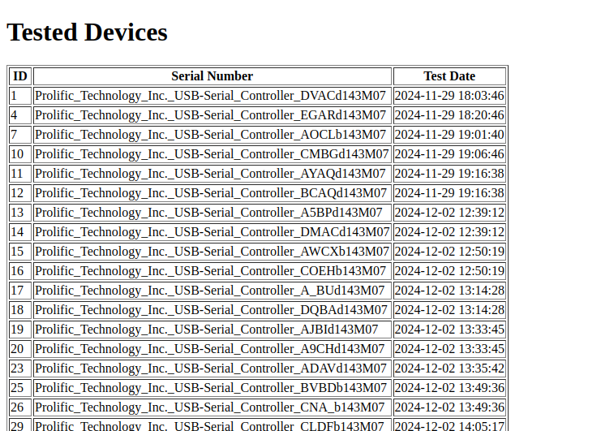

# Flask Application for Displaying Tested Devices from MySQL Database

## Project Overview
This project demonstrates a simple **Flask web application** integrated with a **MySQL database** to display data from a `tested_devices` table. The app retrieves data from the database and renders it on a web page using an HTML template.

---

## Key Features
- **Database Integration:**
  - Connects to a MySQL database using the `Flask-MySQLdb` library.
  - Fetches all rows from the `tested_devices` table.

- **Dynamic Web Interface:**
  - Renders data dynamically on a web page using a Jinja2 template (`index.html`).

- **Flask Routing:**
  - Implements a single route (`/`) to display the list of tested devices.

- **Resource Linking:**
  - Includes links to related files or repositories for additional context or tools.

---

## Workflow
1. **Database Configuration:**
   - Configures MySQL connection settings, including host, user, password, and database name.

2. **Database Query Execution:**
   - Opens a database connection and executes an SQL query to fetch all records from the `tested_devices` table.
   - Closes the connection after retrieving the data.

3. **Rendering Data:**
   - Passes the retrieved data (`devices`) to the `index.html` template for rendering.

4. **Web Application:**
   - Runs the Flask application in debug mode, accessible via `http://127.0.0.1:5000/`.

5. **File Linking:**
   - Provides links to related files, such as scripts or resources from other repositories, for extended functionality.

---

## Configuration
### **MySQL Settings:**
Update the following settings in the code to match your database configuration:
```python
app.config['MYSQL_HOST'] = 'localhost'       # Database host
app.config['MYSQL_USER'] = 'your_username'  # MySQL username
app.config['MYSQL_PASSWORD'] = 'your_password'  # MySQL password
app.config['MYSQL_DB'] = 'tested_devices'   # Database name
```

### **HTML Template:**
Create an `index.html` file in the following folder structure:
```
templates/
└── pages/
    └── index.html
```
Example:
```html
<!DOCTYPE html>
<html lang="en">
<head>
    <meta charset="UTF-8">
    <meta name="viewport" content="width=device-width, initial-scale=1.0">
    <title>Tested Devices</title>
</head>
<body>
    <h1>Tested Devices</h1>
    <table border="1">
        <tr>
            <th>ID</th>
            <th>Serial Number</th>
            <th>Test Date</th>
        </tr>
        
        <tr>
            <td>{{ device[0] }}</td>
            <td>{{ device[1] }}</td>
            <td>{{ device[2] }}</td>
        </tr>
        
    </table>
    <p>For additional resources, see the <a href="https://github.com/DaniAlRab/Prolific_2303_Communication_Test_With_Mysql">Prolific_2303_Communication_Test_With_Mysql</a>.</p>
</body>
</html>
```

---

## Requirements
- **Python Libraries:**
  - `Flask`
  - `Flask-MySQLdb`

- **MySQL Database:**
  - Ensure the database contains a table named `tested_devices` with the following structure:
    ```sql
    CREATE TABLE tested_devices (
        id INT AUTO_INCREMENT PRIMARY KEY,
        serial_number VARCHAR(255) UNIQUE NOT NULL,
        test_date TIMESTAMP DEFAULT CURRENT_TIMESTAMP
    );
    ```
  - This database could be generated following the instructions of this other repository:
    [Prolific_2303_Communication_Test_With_Mysql](https://github.com/DaniAlRab/Prolific_2303_Communication_Test_With_Mysql)

---

## Usage
1. Install the required Python libraries:
   ```bash
   pip install flask flask-mysqldb
   ```

2. Set up your MySQL database and insert some test data:
   ```sql
   INSERT INTO tested_devices (serial_number) VALUES ('SN12345');
   INSERT INTO tested_devices (serial_number) VALUES ('SN67890');
   ```

3. Create the `index.html` file in the `templates/pages` folder within the project directory.

4. Run the Flask application:
   ```bash
   python app.py
   ```

5. Open your browser and visit `http://127.0.0.1:5000/` to view the data.

---

## Example Output
- **Web Page:**
  Displays a table of tested devices with columns for `ID`, `Serial Number`, and `Test Date`.

  

- **Console Output:**
  ```
  * Serving Flask app 'Flask_Mysql_Html'
  * Debug mode: on
  WARNING: This is a development server. Do not use it in a production deployment. Use a production WSGI server instead.
  * Running on http://127.0.0.1:5000
  Press CTRL+C to quit
  * Restarting with stat
  * Debugger is active!
  * Debugger PIN: 486-562-837
  127.0.0.1 - - [17/Jan/2025 19:04:50] "GET / HTTP/1.1" 200 -
  127.0.0.1 - - [17/Jan/2025 19:04:53] "GET / HTTP/1.1" 200 -
  ```

---

## Notes
- Ensure the MySQL database service is running and accessible.
- Place the `index.html` file in the specified folder structure: `templates/pages/`.
